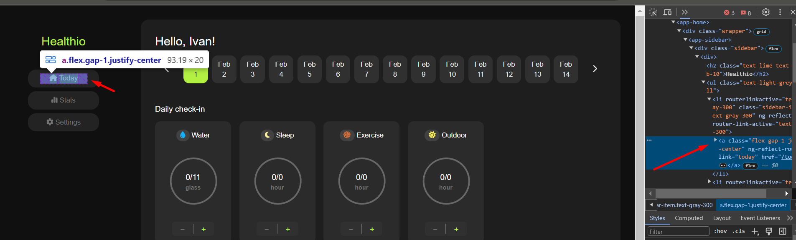

1. Здесь ссылка размерами меньше чем UI кнопки, и следовательно получается так, что если кликнуть на край кнопки она не
   реагирует, такого быть не должно 
2. Я вижу ты добавила loading спиннер (индикатор загрузки). Это очень круто. Но он не работает на некоторые действия (
   например, на странице с календарём при клике на "save"). Хорошей практикой является показ такого спиннера на все
   асинхронные операции (например, загрузка данных с сервера, отправка данных на сервер).
3. Сайт стилистически оформлен неплохо. Многие студенты любят использовать очень яркие цвета. У тебя и шрифт и цветовая
   гамма хорошая 
